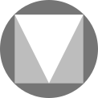

<!-- PROJECT LOGO -->
<div align="center">
  <a href="https://github.com/vineelsai26/Material-Icons">
    
  </a>

  <h1 align="center">Material Icons</h1>

  <p align="center">
    A simple website to use material design icons as urls
    <br />
    <a href="https://github.com/vineelsai26/Material-Icons#readme"><strong>Explore the docs »</strong></a>
    <br />
    <br />
    <a href="https://github.com/vineelsai26/Material-Icons/issues">Report Bug</a>
    ·
    <a href="https://github.com/vineelsai26/Material-Icons/issues">Request Feature</a>
  </p>
</div>

<p align="center">
  <a herf="https://github.com/vineelsai26/Material-Icons/graphs/contributors">
    
  </a>
  <a herf="https://github.com/vineelsai26/Material-Icons/network/members">
    
  </a>
  <a herf="https://github.com/vineelsai26/Material-Icons/stargazers">
    
  </a>
  <a herf="https://github.com/vineelsai26/Material-Icons/issues">
    
  </a>
  <a herf="https://github.com/vineelsai26/Material-Icons/blob/master/LICENSE.txt">
    
  </a>
</p>

## Usage

### Basic Url Structure

* Basic structure of the url

```url
https://material.vineelsai.com/<Icon Name>?type=<Type of Icon>
```

### Example

* 1k filled icon


```url
https://material.vineelsai.com/1k?type=filled
```

or

```url
https://material.vineelsai.com/1k
```

* 1k outlined icon


```url
https://material.vineelsai.com/1k?type=outlined
```

* 1k round icon


```url
https://material.vineelsai.com/1k?type=round
```

* 1k sharp icon


```url
https://material.vineelsai.com/1k?type=sharp
```

* 1k two tone icon


```url
https://material.vineelsai.com/1k?type=two_tone
```

## Technical Details

### Built With

* [Node.js](https://nodejs.org)
* [Cloudflare Pages](https://pages.cloudflare.com)
* [Cloudflare Page Functions](https://developers.cloudflare.com/pages/platform/functions)
* [Wrangler](https://developers.cloudflare.com/workers/wrangler)

<!-- GETTING STARTED -->
## Running Locally

### Prerequisites

* [Node.js](https://nodejs.org) - latest LTS should work fine
* [Yarn](https://yarnpkg.com) - I use version 3 older versions should work as well

### Installation

* Fork the repo
* Clone the repo

   ```sh
   git clone https://github.com/your_username/Material-Icons
   ```

* Install dependencies

    ```sh
    yarn install
    ```

* Run the wrangler dev server

    ```sh
    yarn dev
    ```

<!-- CONTRIBUTING -->
## Contributing

Contributions are what make the open source community such an amazing place to learn, inspire, and create. Any contributions you make are **greatly appreciated**.

If you have a suggestion that would make this better, please fork the repo and create a pull request. You can also simply open an issue with the tag "enhancement".
Don't forget to give the project a star! Thanks again!

1. Fork the Project
2. Create your Feature Branch (`git checkout -b feature/AmazingFeature`)
3. Commit your Changes (`git commit -m 'Add some AmazingFeature'`)
4. Push to the Branch (`git push origin feature/AmazingFeature`)
5. Open a Pull Request

<!-- LICENSE -->
## License

Distributed under the MIT License. See [LICENSE.md]('https://github.com/vineelsai26/Material-Icons/LICENSE.md') for more information.

<!-- CONTACT -->
## Contact

* Twitter - [@vineelsai26](https://twitter.com/vineelsai26)

* Email - mail@vineelsai.com

* Website - [vineelsai.com](https://vineelsai.com)
